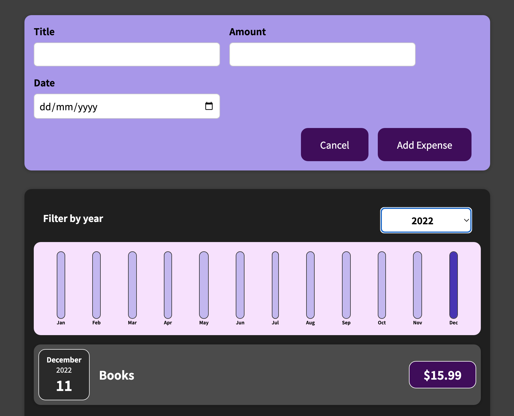

# ExpensesTracker

### Usage

Run `npm install` and `npm start` to install necessary packages and start the project.

## Description

An expenses tracker app built with React. The application allows users to add an expenses (name, price, date) to a list of purchased items. Beneath the add expense component, there is a chart displaying expenses for the filtered year as a percentage of total yearly spend, with a bar for each month. Below again, is a list of each expense with the logged details.

This app was built as part of React - The Complete Guide course available on Udemy:
https://www.udemy.com/course/react-the-complete-guide-incl-redux/

## Screenshots

### App Interface

  

### Adding New Expense

  

### Filtering to New Year

